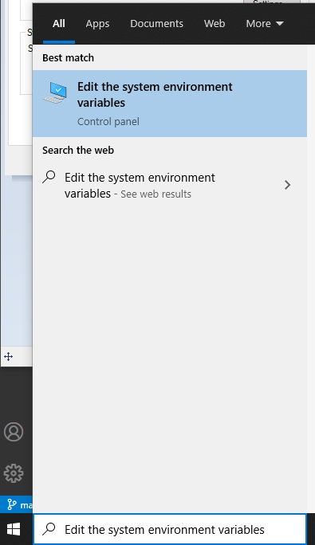
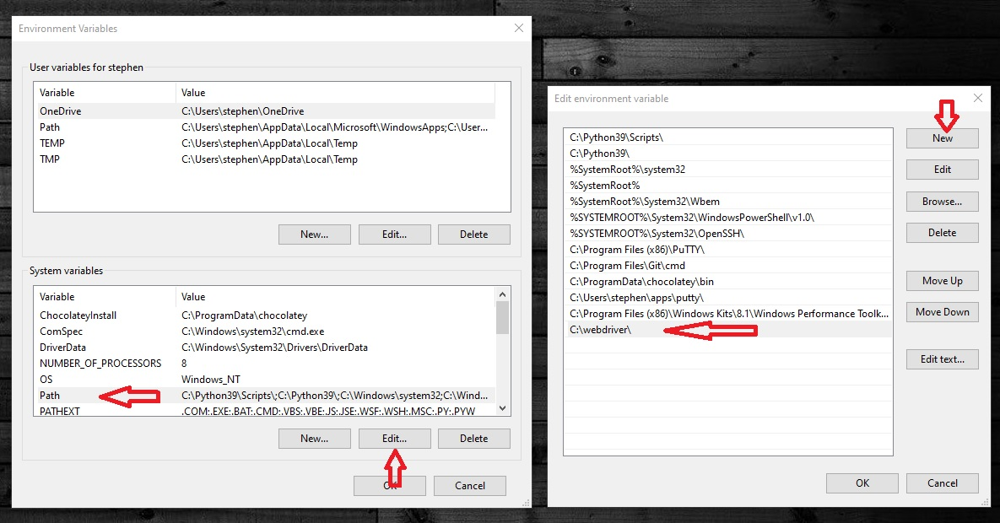
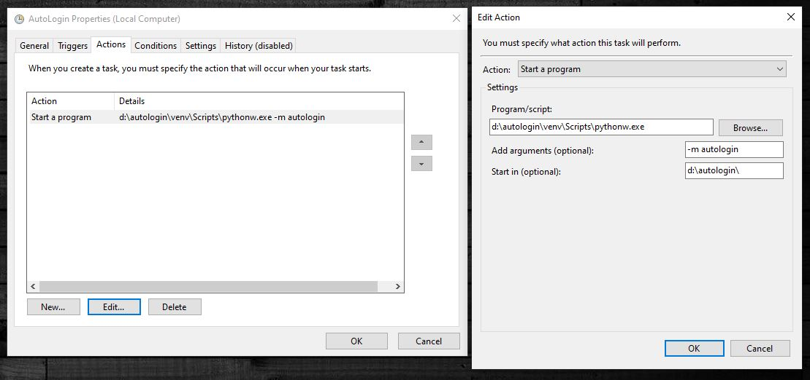

# Autologin Script

## Prerequisites

This script was tested under Windows 10, and Python 3.9.0.
To run it, you will need to install a Python environment, a browser, and the matching webdriver. Get them from the links below:

  * [Python](https://python.org)
  * [Firefox](https://www.mozilla.org/firefox/) and [Geckodriver](https://github.com/mozilla/geckodriver/releases)
  * or [Chrome](https://www.google.com/chrome/) and [ChromeDriver](https://chromedriver.chromium.org/)

CromeDriver and GeckoDriver need to be available in the *PATH* environment variable. To achieve this, extract the files from the downloaded ZIP archives into an arbitrary folder, eg. _C:\\webdriver\\_.

In the start menu, search for the "Edit the system environment variables" item:


Click on the "Environment Variables" button:


Add the folder containing *geckodriver.exe* and/or *chormedriver.exe* to the "System Variables" -> "Path" variable:


## Set up the script

Download or clone this repo into an arbitrary folder. I will use the following path as an example:
```
d:\autologin\
```

Open _autologin.ini_ and edit the following options:
  * url
  * username
  * password
  * webdriver

Leave the rest of the settings as they are, those are only for debugging.

From the project folder, initialize an empty Python virtual environment:

```
d:\autologin> python -m venv venv
```

Activate the environment:

```
d:\autologin> venv\Scripts\activate.bat
(venv) d:\autologin>
```

Install the script's dependencies:
```
(venv) d:\autologin> pip install -r requirements.txt
```

The autologin package is executable by itself, you can start it like this:

```
(venv) d:\autologin> python -m autologin
```

The script can be started on Windows LogOn, using the Task Scheduler, and one way to make it work is to point the executable to the _pythonw.exe_ in your _venv\\Scripts\\_ folder, and set the _Start in_ folder to your project root:




